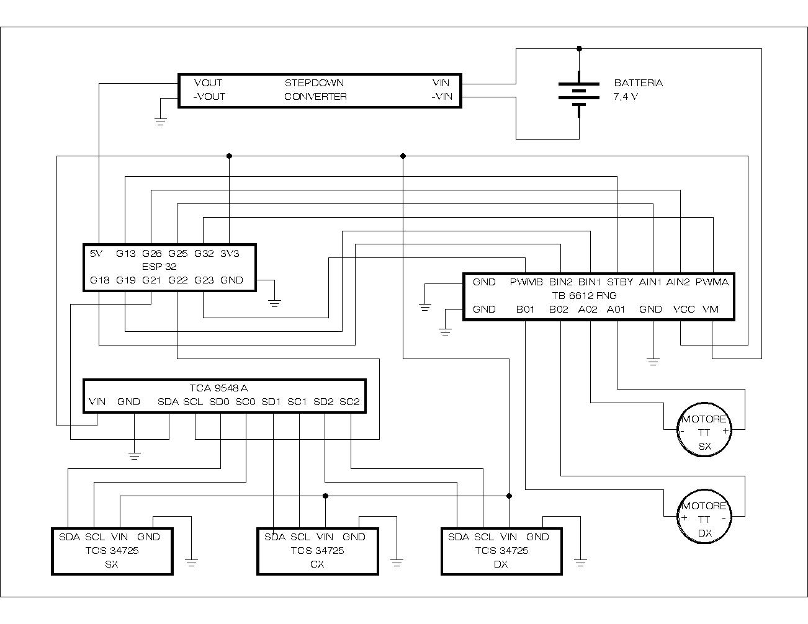

# ProgettoEmbedded_lineFollower
Il progetto è ideato per realizzare un veicolo a guida autonoma basato su ESP32, in grado di seguire percorsi tracciati da linee colorate. Il sistema acquisisce dati da sensori ottici, calcola l'errore di traiettoria, genera l'azione di correzione tramite un algoritmo PID e pilota i motori. Le funzioni di telemetria e taratura parametri (live-tuning) sono gestite a distanza tramite Wi-Fi e protocollo MQTT.

## Componenti:
* **Microcontrollore:** ESP32
* **Driver Motori:** TB6612FNG (Ponte H a MOSFET)
* **Sensori di Colore:** 3x Adafruit TCS34725
* **Multiplexer I2C:** TCA9548A
* **Attuatori:** 2x Motori DC
* **Alimentazione:** Batteria + Modulo Step-Down

## Schema Elettrico
Di seguito lo schema dei collegamenti hardware del robot:

## Librerie Usate:
* `Wire.h`: Gestione del bus I2C per la comunicazione con sensori e multiplexer.
* `WiFi.h`: Connessione alla rete locale.
* `PubSubClient.h`: Gestione della messaggistica MQTT.
* `Adafruit_TCS34725.h`: Lettura dei dati ottici grezzi.
* `QuickPID.h`: Implementazione PID.
* `TaskScheduler.h`: Gestione del multi-tasking.

## Gestione Task
Le operazioni sono eseguite in parallelo per non bloccare mai la guida:
* **tDrive (30 ms):** Legge i sensori tramite I2C, calcola il PID e aggiorna il PWM dei motori.
* **tMqttRicezione (100 ms):** Ascolta il broker MQTT per comandi real-time.
* **tMqttPublish (2000 ms):** Pubblica la telemetria (stato, colore letto).
* **tReconnect (3000 ms):** Failsafe automatico. Se cade la connessione, blocca immediatamente i motori, tenta la riconnessione in background. Ad operazione riuscita, la task si auto-sospende.

## Interfaccia MQTT (Live-Tuning)
Il robot si tara in corsa senza necessità di ricaricare il firmware:
* **Comandi:** `macchina/cmd/linea` (es. "rosso" o "rosso,sinistra" per forzare la direzione di ricerca) e `macchina/cmd/stop`.
* **Tuning:** Regolazione live via topic dedicati per `Kp`, `Kd`, `velMax` e `minPWM`.
